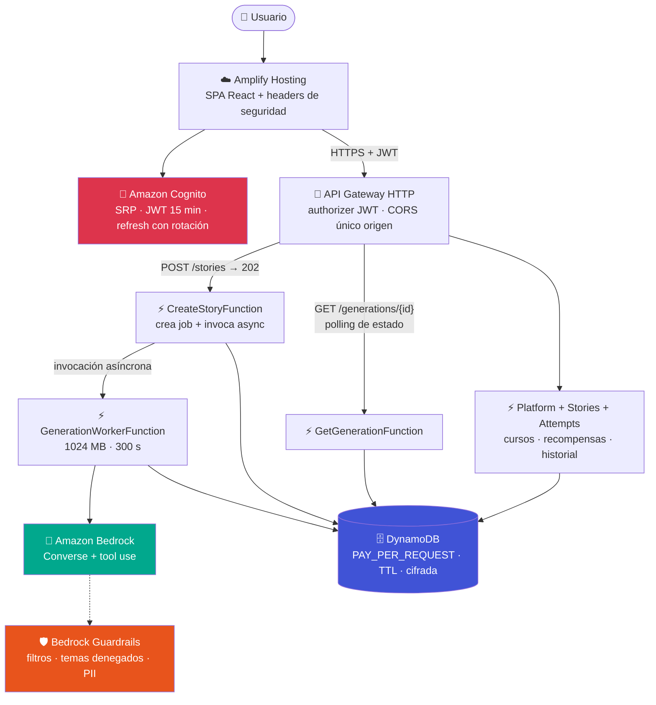
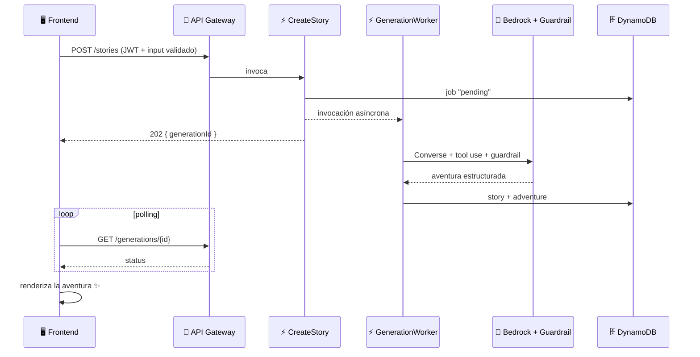

<div align="center">

# 📖✨ Story Teacher by Lumi

### Aventuras de lectura con IA que hacen que los niños vuelvan a amar leer

[](https://react.dev)
[](https://www.typescriptlang.org)
[](https://nodejs.org)
[](https://aws.amazon.com/serverless/sam/)
[](https://aws.amazon.com/bedrock/)
[](https://aws.amazon.com/cognito/)
[](https://aws.amazon.com/dynamodb/)

**[🌐 Demo en vivo](https://main.d3l7lwifmxwzzj.amplifyapp.com)** · **[📚 Documentación](#-documentación)** · **[🚀 Levantar en local](#-cómo-replicar-en-local)**

</div>

---

## 🎯 Nuestra misión

> 💬 *Cada vez más niños pasan horas haciendo scroll, y mantener la atención en la lectura se vuelve más difícil. La comprensión lectora es justamente una de las habilidades más importantes de la infancia.*

**Story Teacher** es una plataforma educativa con IA generativa que ayuda a niñas y niños de **6 a 12 años** a recuperar el gusto por la lectura. Crea **aventuras interactivas personalizadas** donde el lector toma decisiones que cambian la historia, evalúa **cinco habilidades de comprensión** con un quiz alineado a lo que realmente leyó, y conecta a estudiantes con docentes y familias mediante cursos, misiones, seguimiento y felicitaciones.

> [!IMPORTANT]
> Nuestra misión no es reemplazar al docente: es darle una herramienta para crear experiencias de lectura adaptadas a cada estudiante y medir su progreso de forma sencilla, en un entorno **seguro diseñado para menores**. 🛡️

---

## ✨ Qué hace

<table>
<tr>
<td width="50%">

### 🤖 Aventuras generadas por IA
Cuento clásico o interactivo con **3 capítulos, 2 decisiones y 4 finales**, adaptados a edad, tema, dificultad, objetivo educativo y protagonista. Cada generación es única (Amazon Bedrock).

### 🧠 Quiz de 5 habilidades
Literal · Inferencia · Vocabulario · Secuencia · Causa-efecto. Construido sobre **el recorrido que el estudiante eligió**, con explicación por pregunta.

### 🏫 Cursos y misiones
Los adultos crean cursos, invitan por enlace/QR (7 días, revocable) y asignan misiones de lectura.

### 📊 Dashboard docente
Actualización cada 15 s: promedio, completitud, habilidades por estudiante y actividad en tiempo casi real.

</td>
<td width="50%">

### 🏆 Recompensas educativas
Estrellas, 24 hitos de mapa, 24 cartas de poder, 10 minijuegos cognitivos y personajes desbloqueables. Las estrellas nunca se gastan.

### 💌 Postales moderadas
Felicitaciones de hasta 160 caracteres entre adulto y estudiante, sin impacto académico.

### 🔊 Narración TTS
Lectura en voz alta con las voces del dispositivo, en **español o inglés**.

### 🛡️ Seguridad infantil en capas
Guardrails de Bedrock, bloqueo de datos personales, defensa contra inyección de prompts, validación estricta y moderación de postales.

</td>
</tr>
</table>

---

## 🚀 Cómo replicar en local

**Requisitos:** Node.js **22+** · Docker Desktop · puertos `5173`, `3000` y `8000` libres
**No necesitás credenciales de AWS** ✨

```powershell
npm install
npm run local
```

`npm run local` levanta DynamoDB Local, crea la tabla `StoryTeacherLocal`, siembra datos demo de forma idempotente y arranca API + frontend:

| Servicio | URL |
|---|---|
| 🌐 Web | `http://127.0.0.1:5173` |
| 🔌 API | `http://127.0.0.1:3000` |
| 🗄️ DynamoDB Local | `http://127.0.0.1:8000` |

En local la app corre en **modo demo**: login por selección de perfil (sin contraseña), generador `fixture` determinista y gratuito, y datos en DynamoDB Local.

<details>
<summary><b>👥 Perfiles sembrados</b> (clic para expandir)</summary>

| Perfil | Tipo | Estado inicial |
|---|---|---|
| Lucía | Adulto · Profesor/a | Dueña del curso demo |
| Sofía | Estudiante | Miembro, misión completada y recompensas |
| Mateo | Estudiante | Miembro, cuento libre e intento |
| Valentina | Estudiante | Disponible para probar invitaciones |
| Luna | Estudiante | Demo "Todo desbloqueado": 999 estrellas, 24 hitos, cartas y minijuegos |

También podés crear nuevos exploradores desde el login.

</details>

<details>
<summary><b>⌨️ Comandos útiles</b> (clic para expandir)</summary>

```powershell
npm run local:fresh    # reconstruye la tabla local y vuelve a sembrar
npm run db:down        # detiene DynamoDB Local
npm run verify         # typecheck + tests unitarios + builds
npm run ai:test        # escenarios del generador fixture
npm run test:e2e       # recorrido Playwright adulto → invitación → misión → recompensa
npm run sam:validate   # valida template.yaml
npm run sam:build      # bundle de las Lambdas
```

</details>

<details>
<summary><b>🤖 IA en local (opcional, con credenciales AWS)</b> (clic para expandir)</summary>

El generador se elige por variable de entorno:

- `STORY_GENERATOR_MODE=fixture` (default): catálogo local, sin costo.
- `STORY_GENERATOR_MODE=bedrock`: usa tu cuenta de AWS (requiere `aws configure` y acceso al modelo en la región).

Variables relevantes (ver `.env.example`): `BEDROCK_MODEL_ID`, `BEDROCK_GUARDRAIL_ID`, `BEDROCK_GUARDRAIL_VERSION`, `AUTH_MODE`, `SESSION_IP_POLICY`, `VITE_API_URL`, `VITE_AUTH_MODE`, `VITE_COGNITO_USER_POOL_ID`, `VITE_COGNITO_USER_POOL_CLIENT_ID`.

</details>

---

## ☁️ Infraestructura (AWS)

Toda la infraestructura está definida como código en [`template.yaml`](template.yaml) (AWS SAM) y se despliega con un solo comando.



### 🧰 Servicios y su función

| Servicio | Función en el proyecto |
|---|---|
| ☁️ **AWS Amplify Hosting** | Publica el frontend como SPA con CDN, HTTPS y headers de seguridad ([`customHttp.yml`](customHttp.yml): HSTS, CSP, X-Frame-Options…). |
| 🔐 **Amazon Cognito** | Autenticación real por email: User Pool con SRP, tokens JWT de 15 minutos, refresh token con rotación y revocación. |
| 🚪 **Amazon API Gateway** | HTTP API con authorizer JWT de Cognito, CORS restringido al dominio de la app y logs de acceso. |
| ⚡ **AWS Lambda** | 9 funciones Node.js 22: API de historias/intentos/plataforma, creación de trabajos de generación y worker asíncrono. |
| 🤖 **Amazon Bedrock** | Generación de cuentos vía API Converse con *tool use* forzado: la IA devuelve JSON estructurado y validado (escenas, decisiones, checkpoints, quiz). Modelo configurable por parámetro (`BedrockModelId`). |
| 🛡️ **Bedrock Guardrails** | Filtros de contenido en entrada y salida, temas denegados (drogas, armas, autolesiones, romance, apuestas), bloqueo de PII y defensa contra inyección de prompts. |
| 🗄️ **Amazon DynamoDB** | Tabla única PK/SK para perfiles, cursos, historias, intentos, recompensas, jobs de generación y contadores de uso. PAY_PER_REQUEST, cifrada, con TTL y PITR. |
| 📦 **AWS SAM** | Infraestructura como código: build con esbuild y deploy reproducible. |
| 📈 **CloudWatch + X-Ray** | Logs estructurados sin payload sensible y trazas activas en todas las Lambdas. |
| 🔑 **IAM** | Políticas de mínimo privilegio: cada función solo accede a su tabla y solo puede invocar el modelo y el guardrail específicos. |

### 🔄 Flujo de generación (asíncrono)



> [!NOTE]
> El worker corre fuera del límite de 29 s de API Gateway: la generación interactiva tiene hasta 300 s y el frontend nunca ve un timeout.

### 🔒 Seguridad y 💰 control de costos

- 🔐 **Autenticación Cognito** en todas las rutas privadas; en local se conserva el modo demo solo para desarrollo.
- ⏱️ **Límite de 20 generaciones por usuario por día** (`MAX_GENERATIONS_PER_USER_PER_DAY`) con contador atómico en DynamoDB y expiración TTL.
- 🔁 **Idempotencia** obligatoria en generaciones y envíos de quiz.
- 🌐 **Session IP guard** (`observe`/`strict`): huella HMAC del contexto de sesión, nunca como sustituto de la autenticación.
- 💸 **Sin NAT ni VPC**, sin Provisioned Concurrency, DynamoDB on-demand: el costo variable dominante es Bedrock.

> [!WARNING]
> Antes de exponer la demo al público, configurá **AWS Budgets** con avisos a USD 1/5/10. Los detalles están en [docs/05_AWS_COSTOS.md](docs/05_AWS_COSTOS.md).

### 🚢 Despliegue propio

```powershell
sam validate --lint
sam build
sam deploy --guided   # define stack, región, modelo, guardrail y origen CORS
```

El frontend se compila con `VITE_API_URL`, `VITE_AUTH_MODE=cognito` y los IDs
del User Pool, y se publica en Amplify Hosting. `sam delete` no elimina los
recursos con política `Retain` ni la app de Amplify; el procedimiento completo
está en el runbook.

📘 Detalles operativos completos en el [Runbook AWS](docs/15_AWS_RUNBOOK_OPERACIONES.md).

---

## 📚 Documentación

| 📄 Doc | Contenido |
|---|---|
| [Producto y alcance](docs/01_PRODUCTO_MVP.md) | Visión, usuarios y MVP |
| [Arquitectura, API y datos](docs/02_ARQUITECTURA_API_DATOS.md) | Modelo de datos y contratos |
| [IA y seguridad](docs/03_IA_SEGURIDAD.md) | Amenazas y mitigaciones |
| [AWS y costos](docs/05_AWS_COSTOS.md) | Free tier, presupuestos y checklist |
| [Cuentos interactivos con IA](docs/12_IA_CUENTOS_INTERACTIVOS.md) | Diseño del motor de aventuras |
| [AWS, Amplify y Cognito](docs/13_AWS_AMPLIFY_COGNITO.md) | Autenticación y sesiones |
| [Implementación actual de IA](docs/14_IA_IMPLEMENTACION_ACTUAL.md) | Prompts, tool use y validación |
| [Runbook AWS](docs/15_AWS_RUNBOOK_OPERACIONES.md) | Despliegue, diagnóstico y retiro |
| **Contratos** | [OpenAPI](contracts/openapi.yaml) · [Schema clásico](contracts/story-generation.schema.json) · [Schema interactivo](contracts/interactive-story.schema.json) |

---

<div align="center">

Hecho con 💛 para que más niños y niñas vuelvan a disfrutar de la lectura.

**Story Teacher by Lumi** · Hackathon 2026

</div>
