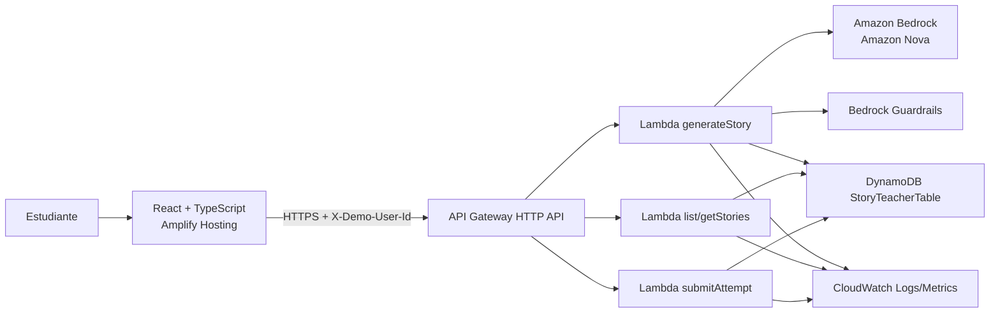
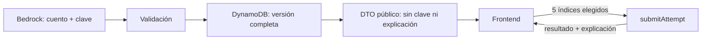

# Arquitectura, API y datos

## 1. Arquitectura elegida



Todo el backend se despliega en `us-east-1` para mantener API, Lambda, DynamoDB y Bedrock en una región con amplia disponibilidad de modelos. El frontend puede servirse globalmente desde la CDN de Amplify.

## 2. Por qué AWS SAM

- Es nativo de AWS y expresa Lambda, API Gateway, DynamoDB, permisos y salidas en un solo `template.yaml`.
- Facilita `sam build`, `sam local start-api` y `sam deploy --guided`.
- Para un hackathon reduce decisiones y demuestra una arquitectura AWS reproducible.
- SAM no agrega un cargo propio; se pagan los recursos AWS creados.

Serverless Framework sigue siendo válido, pero no se mantiene una segunda configuración durante el MVP.

## 3. Componentes

### Frontend

- React + TypeScript con Vite.
- Tailwind con tokens derivados de `lumina_learning/DESIGN.md`.
- React Router para las rutas.
- Zod para validar formularios y respuestas HTTP.
- Estado local para el cuestionario; no hace falta una librería global.
- `localStorage` sólo para `demoUserId`, preferencias visuales y recuperación temporal del formulario.

Rutas propuestas:

| Ruta | Pantalla |
|---|---|
| `/` | Landing |
| `/inicio` | Dashboard/biblioteca |
| `/crear` | Configurador |
| `/historias/:storyId` | Lectura |
| `/historias/:storyId/desafio` | Cuestionario |
| `/historias/:storyId/resultados/:attemptId` | Resultado |

### Backend

Funciones mínimas:

| Función | Responsabilidad | Acceso AWS |
|---|---|---|
| `generateStory` | validar entrada, invocar Guardrails/Bedrock, validar salida y guardar | Bedrock invoke + DynamoDB PutItem |
| `stories` | listar y obtener cuentos públicos | DynamoDB Query/GetItem |
| `submitAttempt` | cargar clave, corregir y guardar intento | DynamoDB GetItem/PutItem |
| `health` | comprobar API sin consumir Bedrock | ninguno |

Separar estas funciones permite permisos mínimos. Para ganar velocidad, `list` y `get` pueden compartir el mismo handler `stories`.

### API Gateway

- HTTP API por su menor costo y configuración más simple.
- CORS sólo para `http://localhost:5173` y la URL real de Amplify.
- Métodos permitidos: `GET`, `POST`, `OPTIONS`.
- Headers permitidos: `Content-Type`, `X-Demo-User-Id`.
- Tamaño máximo de entrada controlado por la Lambda, aunque API Gateway acepte más.

### Bedrock

- Primera opción: `amazon.nova-2-lite-v1:0` o su perfil de inferencia estadounidense disponible en la cuenta.
- Alternativa de demo: `amazon.nova-lite-v1:0` si el modelo anterior no está habilitado.
- Invocación on-demand, sin Provisioned Throughput.
- Temperatura baja (`0.2`) para equilibrar creatividad y consistencia.
- El ID se define como variable de entorno `BEDROCK_MODEL_ID`, nunca queda disperso en el código.

### DynamoDB

- Una tabla: `StoryTeacherTable`.
- Clave de partición `PK` y clave de ordenamiento `SK`.
- Modo provisionado dentro de límites gratuitos para el hackathon, por ejemplo 5 RCU/5 WCU.
- Sin streams, backups bajo demanda, DAX, tablas globales ni PITR en el MVP.
- `PAY_PER_REQUEST` es más cómodo ante tráfico incierto, pero no aprovecha las 25 RCU/25 WCU de la oferta gratuita provisionada; por eso se elige provisionado para una demo pequeña.

## 4. Diseño de datos

El `storyId` y `attemptId` son ULID: únicos y ordenables por fecha.

### Item de cuento

```json
{
  "PK": "USER#demo-sofia",
  "SK": "STORY#01J...",
  "entityType": "STORY",
  "storyId": "01J...",
  "createdAt": "2026-07-21T20:00:00.000Z",
  "input": {
    "age": 8,
    "theme": "Exploración espacial",
    "difficulty": "media",
    "educationalObjective": "Valorar el trabajo en equipo",
    "maxWords": 300,
    "mainCharacter": "Luna, una gata astronauta"
  },
  "title": "Luna y la estrella perdida",
  "story": "...",
  "questions": [
    {
      "statement": "...",
      "options": ["...", "...", "...", "..."],
      "correctAnswer": 2,
      "skill": "literal",
      "explanation": "..."
    }
  ],
  "modelId": "amazon.nova-2-lite-v1:0",
  "promptVersion": "story-v1"
}
```

### Item de intento

```json
{
  "PK": "USER#demo-sofia",
  "SK": "ATTEMPT#01J_STORY#01J_ATTEMPT",
  "entityType": "ATTEMPT",
  "attemptId": "01J_ATTEMPT",
  "storyId": "01J_STORY",
  "createdAt": "2026-07-21T20:10:00.000Z",
  "answers": [2, 0, 1, 3, 2],
  "correctCount": 4,
  "scorePercent": 80,
  "bySkill": {
    "literal": true,
    "inference": true,
    "vocabulary": false,
    "sequence": true,
    "cause_effect": true
  }
}
```

### Consultas

- Listar cuentos: `Query PK = USER#demo-sofia AND begins_with(SK, STORY#)`, descendente.
- Obtener cuento: `GetItem(PK, STORY#storyId)`.
- Guardar intento: `PutItem` con condición `attribute_not_exists(PK)`.
- Historial de intentos de un cuento: consulta por prefijo `ATTEMPT#storyId#` si se agrega después del MVP.

El tamaño de una historia de 500 palabras con preguntas queda muy por debajo del máximo de 400 KB por item de DynamoDB.

## 5. Contrato HTTP

La fuente completa es [openapi.yaml](../contracts/openapi.yaml). Resumen:

| Método | Ruta | Uso |
|---|---|---|
| `GET` | `/health` | salud sin consumo de IA |
| `POST` | `/stories` | generar y guardar cuento |
| `GET` | `/stories` | listar cuentos del perfil demo |
| `GET` | `/stories/{storyId}` | obtener cuento sin clave de respuestas |
| `POST` | `/stories/{storyId}/attempts` | corregir cinco respuestas y guardar intento |

Todos los endpoints privados reciben `X-Demo-User-Id` con el identificador de un perfil sembrado. El backend resuelve ese perfil en DynamoDB y verifica rol, propiedad y membresía para cada operación. Sigue siendo una simulación y no aporta seguridad de producción.

## 6. Separación de datos públicos y privados

La respuesta cruda de Bedrock incluye `correctAnswer` y `explanation`, porque el backend necesita corregir. El frontend no debe recibirlos al crear o abrir un cuento.



## 7. Respuestas y errores

Formato común de error:

```json
{
  "error": {
    "code": "GENERATION_FAILED",
    "message": "No pudimos crear la aventura. Intentá nuevamente.",
    "requestId": "..."
  }
}
```

| Código | HTTP | Cuándo |
|---|---:|---|
| `VALIDATION_ERROR` | 400 | campos fuera de regla |
| `CONTENT_BLOCKED` | 422 | Guardrail bloquea entrada o salida |
| `STORY_NOT_FOUND` | 404 | cuento inexistente para el perfil |
| `ATTEMPT_ALREADY_EXISTS` | 409 | reenvío con el mismo ID idempotente |
| `GENERATION_TIMEOUT` | 504 | Bedrock no responde dentro del límite |
| `GENERATION_FAILED` | 502 | salida inválida tras el único reintento |
| `INTERNAL_ERROR` | 500 | error inesperado sin detalle sensible |

El frontend muestra mensajes infantiles y accionables; nunca muestra stack traces ni texto crudo del proveedor.

## 8. Idempotencia y duplicados

- El frontend crea un `Idempotency-Key` para `POST /stories`.
- La Lambda guarda una marca breve o usa ese valor como `storyId` condicionado.
- Repetir la misma solicitud devuelve el mismo cuento si ya fue persistido.
- El botón de creación queda deshabilitado mientras hay una solicitud activa.

Si implementar idempotencia completa pone en riesgo P0, el mínimo aceptable es deshabilitar doble envío y usar escrituras condicionales.

## 9. Variables de entorno

```text
TABLE_NAME
BEDROCK_MODEL_ID
BEDROCK_GUARDRAIL_ID
BEDROCK_GUARDRAIL_VERSION
PROMPT_VERSION=story-v1
ALLOWED_ORIGIN
LOG_LEVEL=INFO
```

No se usan access keys en `.env`: Lambda recibe permisos mediante su IAM Role. Para desarrollo local, AWS CLI usa un perfil del desarrollador fuera del repositorio.

## 10. IAM mínimo

- `generateStory`: `bedrock:InvokeModel`, acciones necesarias del guardrail y `dynamodb:PutItem` sólo sobre la tabla.
- `stories`: `dynamodb:GetItem` y `dynamodb:Query`.
- `submitAttempt`: `dynamodb:GetItem` y `dynamodb:PutItem`.
- Logs básicos de Lambda en CloudWatch.
- Ninguna función recibe `dynamodb:*`, `bedrock:*` o permisos administrativos.

## 11. Observabilidad

Cada request registra JSON estructurado:

```json
{
  "level": "INFO",
  "event": "story.generated",
  "requestId": "...",
  "storyId": "...",
  "durationMs": 8420,
  "modelId": "...",
  "promptVersion": "story-v1",
  "validationRetry": false
}
```

No se registra el cuento completo, el objetivo libre, el protagonista ni las respuestas crudas de Bedrock. Métricas mínimas:

- `StoryGenerationSuccess`.
- `StoryGenerationFailure`.
- `ContentBlocked`.
- `InvalidModelOutput`.
- latencia p50/p95 observada en logs.

Retención de logs: 7 días para el hackathon.

## 12. Pruebas

### Unitarias

- validación de entrada;
- conteo de palabras;
- cinco preguntas y cuatro opciones;
- conjunto exacto de habilidades;
- índices 0–3;
- eliminación de respuestas privadas en el DTO;
- cálculo de puntaje.

### Integración

- Lambda con Bedrock simulado devuelve y guarda una historia.
- salida inválida provoca un reintento y luego error controlado.
- `submitAttempt` no acepta menos o más de cinco respuestas.
- un usuario demo no puede consultar una PK distinta.

### Smoke test desplegado

1. `GET /health` devuelve 200.
2. `POST /stories` crea una historia.
3. `GET /stories` la lista.
4. `GET /stories/{id}` no contiene `correctAnswer`.
5. `POST /attempts` devuelve el puntaje esperado.

## 13. Riesgo de tiempo de respuesta

API Gateway HTTP API mantiene una ventana de integración limitada. La generación se implementa sincrónica para mantener el MVP simple y debe probarse temprano con el máximo de 500 palabras. Si p95 supera 25 segundos, el recorte preferido es limitar “Larga” a 400 palabras antes que agregar SQS, jobs y polling en el día 4.
