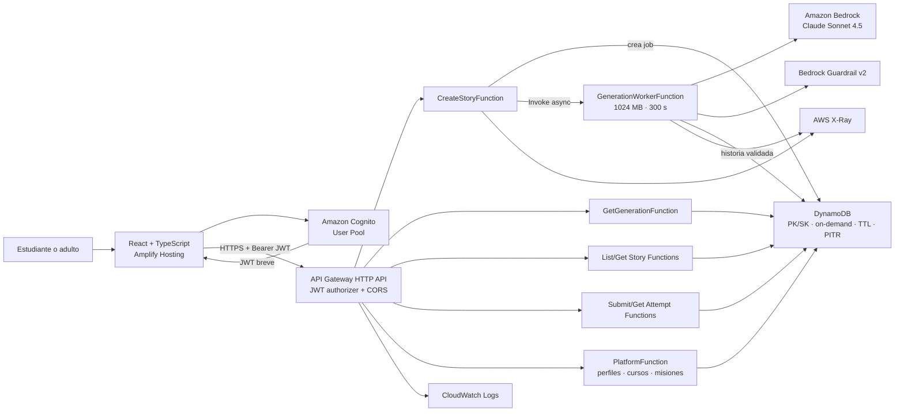
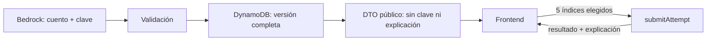

# Arquitectura, API y datos

> Estado de la arquitectura desplegada en `us-east-2`. Para el detalle del
> prompt, validación y contrato de Bedrock consultar
> [Implementación actual de IA](14_IA_IMPLEMENTACION_ACTUAL.md). Para operar o
> retirar la infraestructura consultar el
> [runbook AWS](15_AWS_RUNBOOK_OPERACIONES.md).

## 1. Arquitectura elegida



Todo el backend se despliega en `us-east-2`. El frontend se publica globalmente
desde la CDN de Amplify. `POST /stories` no espera la respuesta del modelo:
persiste un job, invoca el worker de manera asíncrona y devuelve `202`.

## 2. Por qué AWS SAM

- Es nativo de AWS y expresa Lambda, API Gateway, DynamoDB, permisos y salidas en un solo `template.yaml`.
- Facilita `sam build`, `sam local start-api` y `sam deploy --guided`.
- Para un hackathon reduce decisiones y demuestra una arquitectura AWS reproducible.
- SAM no agrega un cargo propio; se pagan los recursos AWS creados.

Serverless Framework sigue siendo válido, pero no se mantiene una segunda configuración durante el MVP.

## 3. Componentes

### Frontend

- React + TypeScript con Vite.
- Tailwind con tokens derivados de `lumina_learning/DESIGN.md`.
- React Router para las rutas.
- Zod para validar formularios y respuestas HTTP.
- Estado local para el cuestionario; no hace falta una librería global.
- En producción, Amplify Auth conserva tokens Cognito en `sessionStorage`.
- `localStorage` sólo se usa en la demo local y para preferencias no sensibles.

Rutas propuestas:

| Ruta | Pantalla |
|---|---|
| `/` | Landing |
| `/inicio` | Dashboard/biblioteca |
| `/crear` | Configurador |
| `/historias/:storyId` | Lectura |
| `/historias/:storyId/desafio` | Cuestionario |
| `/historias/:storyId/resultados/:attemptId` | Resultado |

### Backend

Funciones desplegadas:

| Función | Responsabilidad | Acceso AWS |
|---|---|---|
| `CreateStoryFunction` | validar entrada, crear el job e invocar el worker asíncrono | DynamoDB + `lambda:InvokeFunction` sobre el worker |
| `GenerationWorkerFunction` | invocar Guardrails/Bedrock, validar, reparar una vez y guardar | Bedrock + Guardrail + DynamoDB |
| `GetGenerationFunction` | devolver estado o resultado del job | DynamoDB |
| `ListStoriesFunction` / `GetStoryFunction` | listar y obtener cuentos públicos | DynamoDB Query/GetItem |
| `SubmitAttemptFunction` / `GetAttemptFunction` | corregir, guardar y consultar intentos | DynamoDB |
| `PlatformFunction` | perfiles, cursos, misiones, recompensas y actividad | DynamoDB |
| `HealthFunction` | comprobar API sin consumir Bedrock | sin Bedrock |

### API Gateway

- HTTP API por su menor costo y configuración más simple.
- JWT authorizer de Cognito en todas las rutas privadas.
- CORS limitado a la URL productiva de Amplify; SAM local usa su configuración
  independiente.
- Métodos permitidos: `GET`, `POST`, `OPTIONS`.
- Headers permitidos: `Authorization`, `Content-Type` e `Idempotency-Key`.
- Tamaño máximo de entrada controlado por la Lambda, aunque API Gateway acepte más.

### Bedrock

- Modelo desplegado: perfil de inferencia
  `us.anthropic.claude-sonnet-4-5-20250929-v1:0`.
- Invocación on-demand, sin Provisioned Throughput.
- Temperatura baja (`0.3`) para equilibrar creatividad y consistencia.
- Guardrail `story-teacher-guardrail`, versión `2`, aplicado a entrada y salida.
- El ID se define como variable de entorno `BEDROCK_MODEL_ID`, nunca queda disperso en el código.

### DynamoDB

- Una tabla: `StoryTeacherTable`.
- Clave de partición `PK` y clave de ordenamiento `SK`.
- Capacidad `PAY_PER_REQUEST` para absorber tráfico irregular.
- Cifrado administrado, TTL sobre `ttl` y point-in-time recovery habilitado.
- Sin Streams, DAX ni tablas globales.
- `DeletionPolicy: Retain` y `UpdateReplacePolicy: Retain`: eliminar el stack no
  elimina automáticamente la tabla.

## 4. Diseño de datos

El `storyId` y `attemptId` son ULID: únicos y ordenables por fecha.

### Item de cuento

```json
{
  "PK": "USER#demo-sofia",
  "SK": "STORY#01J...",
  "entityType": "STORY",
  "storyId": "01J...",
  "createdAt": "2026-07-21T20:00:00.000Z",
  "input": {
    "age": 8,
    "theme": "Exploración espacial",
    "difficulty": "media",
    "educationalObjective": "Valorar el trabajo en equipo",
    "maxWords": 300,
    "mainCharacter": "Luna, una gata astronauta"
  },
  "title": "Luna y la estrella perdida",
  "story": "...",
  "questions": [
    {
      "statement": "...",
      "options": ["...", "...", "...", "..."],
      "correctAnswer": 2,
      "skill": "literal",
      "explanation": "..."
    }
  ],
  "modelId": "us.anthropic.claude-sonnet-4-5-20250929-v1:0",
  "promptVersion": "story-v1"
}
```

### Item de intento

```json
{
  "PK": "USER#demo-sofia",
  "SK": "ATTEMPT#01J_STORY#01J_ATTEMPT",
  "entityType": "ATTEMPT",
  "attemptId": "01J_ATTEMPT",
  "storyId": "01J_STORY",
  "createdAt": "2026-07-21T20:10:00.000Z",
  "answers": [2, 0, 1, 3, 2],
  "correctCount": 4,
  "scorePercent": 80,
  "bySkill": {
    "literal": true,
    "inference": true,
    "vocabulary": false,
    "sequence": true,
    "cause_effect": true
  }
}
```

### Consultas

- Listar cuentos: `Query PK = USER#demo-sofia AND begins_with(SK, STORY#)`, descendente.
- Obtener cuento: `GetItem(PK, STORY#storyId)`.
- Guardar intento: `PutItem` con condición `attribute_not_exists(PK)`.
- Historial de intentos de un cuento: consulta por prefijo `ATTEMPT#storyId#` si se agrega después del MVP.

El tamaño de una historia de 500 palabras con preguntas queda muy por debajo del máximo de 400 KB por item de DynamoDB.

## 5. Contrato HTTP

La fuente completa es [openapi.yaml](../contracts/openapi.yaml). Resumen:

| Método | Ruta | Uso |
|---|---|---|
| `GET` | `/health` | salud sin consumo de IA |
| `POST` | `/stories` | iniciar generación asíncrona de cuento o preview de misión |
| `GET` | `/generations/{generationId}` | consultar el job y recibir el cuento terminado |
| `GET` | `/stories` | listar cuentos del perfil demo |
| `GET` | `/stories/{storyId}` | obtener cuento sin clave de respuestas |
| `POST` | `/stories/{storyId}/attempts` | corregir cinco respuestas y guardar intento |
| `POST` | `/courses/{courseId}/missions` | publicar una preview ya generada en el curso |

En producción, todos los endpoints privados reciben `Authorization: Bearer
<JWT>`. API Gateway valida firma, emisor, audiencia y expiración; el backend usa
el claim estable `sub` y verifica rol, propiedad y membresía. `X-Demo-User-Id`
queda limitado a SAM local.

## 6. Separación de datos públicos y privados

La respuesta cruda de Bedrock incluye `correctAnswer` y `explanation`, porque el backend necesita corregir. El frontend no debe recibirlos al crear o abrir un cuento.



## 7. Respuestas y errores

Formato común de error:

```json
{
  "error": {
    "code": "GENERATION_FAILED",
    "message": "No pudimos crear la aventura. Intentá nuevamente.",
    "requestId": "..."
  }
}
```

| Código | HTTP | Cuándo |
|---|---:|---|
| `VALIDATION_ERROR` | 400 | campos fuera de regla |
| `CONTENT_BLOCKED` | 422 | Guardrail bloquea entrada o salida |
| `STORY_NOT_FOUND` | 404 | cuento inexistente para el perfil |
| `ATTEMPT_ALREADY_EXISTS` | 409 | reenvío con el mismo ID idempotente |
| `GENERATION_TIMEOUT` | 504 | Bedrock no responde dentro del límite |
| `GENERATION_FAILED` | 502 | salida inválida tras el único reintento |
| `INTERNAL_ERROR` | 500 | error inesperado sin detalle sensible |

El frontend muestra mensajes infantiles y accionables; nunca muestra stack traces ni texto crudo del proveedor.

## 8. Idempotencia y duplicados

- El frontend crea un `Idempotency-Key` para `POST /stories`.
- La Lambda deriva un `generationId`, guarda un job condicionado y sólo despacha
  el worker cuando el job es nuevo.
- Repetir la misma solicitud devuelve el mismo cuento si ya fue persistido.
- Publicar una misión usa el `generationId` completado y una clave determinista
  por `createdAt + missionId`; repetir la confirmación no vuelve a generar.
- El botón de creación queda deshabilitado mientras hay una solicitud activa.

## 9. Variables de entorno

```text
TABLE_NAME
BEDROCK_MODEL_ID
BEDROCK_GUARDRAIL_ID
BEDROCK_GUARDRAIL_VERSION
PROMPT_VERSION=story-v1
ALLOWED_ORIGIN
LOG_LEVEL=INFO
```

No se usan access keys en `.env`: Lambda recibe permisos mediante su IAM Role. Para desarrollo local, AWS CLI usa un perfil del desarrollador fuera del repositorio.

## 10. IAM mínimo

- `GenerationWorkerFunction`: `bedrock:InvokeModel`,
  `bedrock:ApplyGuardrail` y acceso de lectura/escritura sobre la tabla.
- `CreateStoryFunction`: DynamoDB e invocación exclusiva del worker.
- Funciones de lectura: `dynamodb:GetItem` y `dynamodb:Query`.
- Funciones de escritura: acciones concretas de DynamoDB sobre una sola tabla.
- Logs básicos de Lambda en CloudWatch.
- Ninguna función recibe `dynamodb:*`, `bedrock:*` o permisos administrativos.

## 11. Observabilidad

Cada request registra JSON estructurado:

```json
{
  "level": "INFO",
  "event": "story.generated",
  "requestId": "...",
  "storyId": "...",
  "durationMs": 8420,
  "modelId": "...",
  "promptVersion": "story-v1",
  "validationRetry": false
}
```

No se registra el cuento completo, el objetivo libre, el protagonista ni las respuestas crudas de Bedrock. Métricas mínimas:

- `StoryGenerationSuccess`.
- `StoryGenerationFailure`.
- `ContentBlocked`.
- `InvalidModelOutput`.
- latencia p50/p95 observada en logs.

El grupo de access logs de API Gateway tiene retención de 30 días. Los grupos
automáticos `/aws/lambda/story-teacher-dev-*` no tienen actualmente una
retención explícita; es una deuda operativa documentada en el runbook.

## 12. Pruebas

### Unitarias

- validación de entrada;
- conteo de palabras;
- cinco preguntas y cuatro opciones;
- conjunto exacto de habilidades;
- índices 0–3;
- eliminación de respuestas privadas en el DTO;
- cálculo de puntaje.

### Integración

- Lambda con Bedrock simulado devuelve y guarda una historia.
- salida inválida provoca un reintento y luego error controlado.
- `submitAttempt` no acepta menos o más de cinco respuestas.
- un usuario demo no puede consultar una PK distinta.

### Smoke test desplegado

1. `GET /health` devuelve 200.
2. `POST /stories` crea una historia.
3. `GET /stories` la lista.
4. `GET /stories/{id}` no contiene `correctAnswer`.
5. `POST /attempts` devuelve el puntaje esperado.

## 13. Tiempo de respuesta

API Gateway no espera a Bedrock. `CreateStoryFunction` responde `202` después de
persistir el job y despachar `GenerationWorkerFunction` con invocación
asíncrona. El navegador consulta cada 2,5 segundos. Este mismo mecanismo se usa
para aventuras libres y previews de misión, evitando que una generación larga
termine como `502` o timeout de la integración.
