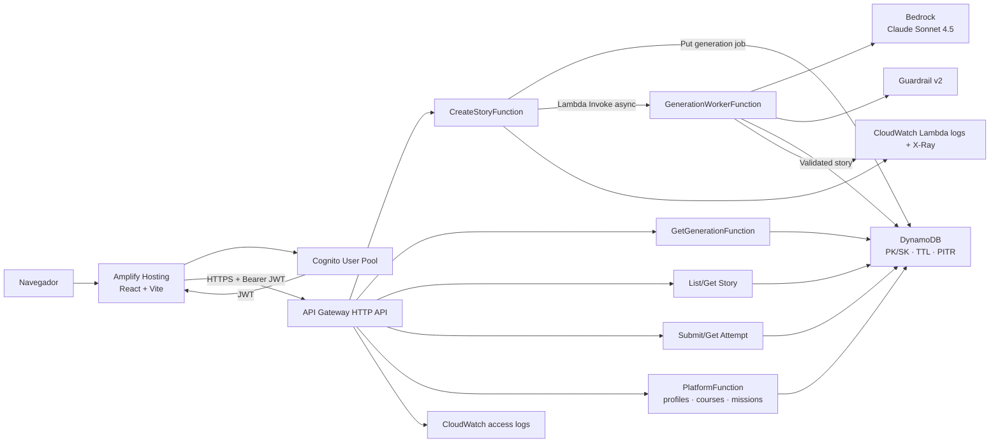

# Runbook AWS: despliegue, diagnóstico, costos y retiro

Estado contrastado con AWS el **26/07/2026**. Este documento distingue los
comandos locales, las consultas de sólo lectura y las acciones que modifican o
eliminan recursos.

## 1. Inventario actual

| Componente | Estado desplegado |
|---|---|
| Región | `us-east-2` |
| Stack SAM/CloudFormation | `story-teacher-dev` |
| Amplify app | `story-teacher` |
| Amplify app ID | `d3l7lwifmxwzzj` |
| Rama Amplify | `main` |
| API Gateway | HTTP API `po5ndzb715` |
| Generador | Amazon Bedrock on-demand |
| Modelo | `us.anthropic.claude-sonnet-4-5-20250929-v1:0` |
| Guardrail | `story-teacher-guardrail`, versión `2` |
| DynamoDB | `PAY_PER_REQUEST`, TTL, cifrado y PITR |
| Autenticación | Cognito User Pool, JWT y tokens en `sessionStorage` |

Los IDs anteriores identifican recursos y configuración pública; no son
contraseñas ni credenciales.

## 2. Esquema de producción



`POST /stories` devuelve `202` después de crear el job. El worker puede usar
hasta 300 segundos sin mantener abierta la petición HTTP. El frontend consulta
`GET /generations/{generationId}` hasta recibir `completed` o `failed`.

## 3. Credenciales y seguridad

Comprobar qué identidad utiliza AWS CLI:

```powershell
aws sts get-caller-identity
```

Las credenciales deben provenir de AWS CLI, SSO o la cadena estándar del SDK.
Nunca deben escribirse en `.env`, `samconfig.toml`, variables `VITE_*`, scripts
ni documentación.

`VITE_COGNITO_USER_POOL_ID`, `VITE_COGNITO_USER_POOL_CLIENT_ID`, URLs, IDs de
app y IDs de Guardrail no conceden acceso por sí solos y terminan visibles en
el navegador.

## 4. Validación y build local

Estos comandos no crean recursos AWS:

```powershell
sam validate --lint
sam build --no-cached --parallel
```

Alias disponibles:

```powershell
npm run sam:validate
npm run sam:build
```

SAM genera los artefactos en `.aws-sam/build`.

## 5. Desplegar o actualizar el backend

La configuración persistente está en `samconfig.toml`. El flujo normal es:

```powershell
sam validate --lint
sam build --no-cached --parallel
sam deploy
```

El `sam deploy` efectivo usa:

```text
stack_name=story-teacher-dev
region=us-east-2
resolve_s3=true
capabilities=CAPABILITY_IAM
StoryGeneratorMode=bedrock
SessionIpPolicy=observe
AllowedOrigin=https://main.d3l7lwifmxwzzj.amplifyapp.com
BedrockModelId=us.anthropic.claude-sonnet-4-5-20250929-v1:0
BedrockGuardrailId=fbqdxds2765e
BedrockGuardrailVersion=2
```

SAM empaqueta las Lambdas, sube artefactos a su bucket administrado, crea un
changeset y hace que CloudFormation cree o actualice:

- nueve funciones Lambda;
- API Gateway HTTP API y su stage;
- DynamoDB;
- Cognito User Pool y cliente;
- roles IAM y permisos de invocación;
- access logs de API Gateway.

CloudFormation y SAM no tienen un precio adicional, pero los recursos
subyacentes sí.

## 6. Consultar el stack

Estado y outputs:

```powershell
aws cloudformation describe-stacks `
  --stack-name story-teacher-dev `
  --region us-east-2 `
  --query "Stacks[0].{Status:StackStatus,Outputs:Outputs}" `
  --output json
```

Inventario:

```powershell
aws cloudformation list-stack-resources `
  --stack-name story-teacher-dev `
  --region us-east-2 `
  --output table
```

Últimos eventos de despliegue:

```powershell
aws cloudformation describe-stack-events `
  --stack-name story-teacher-dev `
  --region us-east-2 `
  --max-items 30 `
  --output table
```

Son consultas de sólo lectura.

## 7. Configurar y publicar Amplify

La app y la rama se crearon como recursos separados del stack SAM:

```powershell
aws amplify create-app `
  --name story-teacher `
  --platform WEB `
  --region us-east-2
```

```powershell
aws amplify create-branch `
  --app-id d3l7lwifmxwzzj `
  --branch-name main `
  --region us-east-2
```

La rama debe contener:

```text
AMPLIFY_MONOREPO_APP_ROOT=frontend
VITE_AUTH_MODE=cognito
VITE_API_URL=<ApiUrl de CloudFormation>
VITE_COGNITO_USER_POOL_ID=<UserPoolId>
VITE_COGNITO_USER_POOL_CLIENT_ID=<UserPoolClientId>
```

Publicación segura del artefacto:

```powershell
$env:AMPLIFY_APP_ID = "d3l7lwifmxwzzj"
$env:AMPLIFY_BRANCH_NAME = "main"
$env:AWS_REGION = "us-east-2"

node scripts/deploy-amplify-files.mjs

Remove-Item Env:AMPLIFY_APP_ID
Remove-Item Env:AMPLIFY_BRANCH_NAME
Remove-Item Env:AWS_REGION
```

El script:

1. ejecuta `aws amplify get-branch`;
2. valida las variables productivas;
3. compila Vite localmente con esas variables;
4. ejecuta `aws amplify create-deployment`;
5. carga cada archivo mediante URLs prefirmadas;
6. ejecuta `aws amplify start-deployment`;
7. consulta `aws amplify get-job`;
8. verifica por HTTP todos los archivos publicados.

Esto no consume minutos de build remoto de Amplify, pero sí almacenamiento y
transferencia del hosting.

Consultar jobs:

```powershell
aws amplify list-jobs `
  --app-id d3l7lwifmxwzzj `
  --branch-name main `
  --region us-east-2 `
  --max-results 10 `
  --output table
```

## 8. Guardrail

El Guardrail fue creado y versionado fuera de CloudFormation. El stack sólo
recibe su ID y versión. Consultarlo:

```powershell
aws bedrock get-guardrail `
  --guardrail-identifier fbqdxds2765e `
  --guardrail-version 2 `
  --region us-east-2
```

La versión actual filtra violencia, conducta indebida, odio, contenido sexual,
insultos, ataques al prompt y temas no aptos; también detecta email, teléfono y
dirección. Crear la definición no consume tokens. Aplicarla durante una
generación sí es facturable.

## 9. Smoke tests

### Producción con Bedrock

`scripts/smoke-production.mjs` ingresa por Cognito, crea un job real, espera al
worker y valida la aventura:

```powershell
node scripts/smoke-production.mjs
```

Requiere variables `SMOKE_EMAIL`, `SMOKE_PASSWORD`, `SMOKE_API_URL`,
`SMOKE_USER_POOL_ID` y `SMOKE_USER_POOL_CLIENT_ID`. Deben existir sólo en el
proceso y eliminarse al terminar.

Este smoke test consume Bedrock. Una respuesta inválida puede producir un único
intento de reparación, por lo que una prueba puede realizar hasta dos llamadas
al modelo y dos aplicaciones del Guardrail.

### Renovación de sesión

```powershell
node scripts/smoke-session-renewal.mjs `
  <function-name> `
  <table-name> `
  us-east-2
```

Invoca una Lambda dos veces y elimina el registro diagnóstico de DynamoDB. No
invoca Bedrock.

## 10. Diagnóstico

Resolver el nombre físico del worker:

```powershell
$worker = aws cloudformation describe-stack-resource `
  --stack-name story-teacher-dev `
  --logical-resource-id GenerationWorkerFunction `
  --region us-east-2 `
  --query "StackResourceDetail.PhysicalResourceId" `
  --output text
```

Ver logs recientes:

```powershell
aws logs tail "/aws/lambda/$worker" `
  --since 1h `
  --region us-east-2
```

Seguir logs en vivo:

```powershell
aws logs tail "/aws/lambda/$worker" `
  --since 10m `
  --follow `
  --region us-east-2
```

Listar grupos, retención y bytes almacenados:

```powershell
aws logs describe-log-groups `
  --log-group-name-prefix "/aws/lambda/story-teacher-dev" `
  --region us-east-2 `
  --query "logGroups[*].{Name:logGroupName,Retention:retentionInDays,Bytes:storedBytes}" `
  --output table
```

No deben copiarse a tickets prompts, historias completas, tokens Cognito ni
respuestas crudas de Bedrock.

## 11. Componentes con costo

Orden práctico de vigilancia:

1. Bedrock y Guardrails por tokens/unidades procesadas.
2. DynamoDB PITR y almacenamiento.
3. CloudWatch Logs sin retención en grupos Lambda.
4. X-Ray por trazas.
5. Amplify por almacenamiento y transferencia.
6. API Gateway, Lambda, Cognito y DynamoDB por uso.

`MAX_GENERATIONS_PER_USER_PER_DAY=20` limita cada usuario, pero no constituye
un límite global de gasto.

## 12. Pausar Bedrock sin apagar la aplicación

Para conservar login, API y datos, pero generar fixtures:

```powershell
sam deploy `
  --parameter-overrides "StoryGeneratorMode=fixture SessionIpPolicy=observe AllowedOrigin=https://main.d3l7lwifmxwzzj.amplifyapp.com BedrockModelId=us.anthropic.claude-sonnet-4-5-20250929-v1:0 BedrockGuardrailId=fbqdxds2765e BedrockGuardrailVersion=2"
```

Para volver a IA se reemplaza `fixture` por `bedrock`. Deben pasarse todos los
parámetros para no restaurar defaults incompatibles con producción.

## 13. Reducir retención sin eliminar datos

Antes de ejecutar cambios, resolver y revisar el nombre exacto de la tabla:

```powershell
aws cloudformation describe-stacks `
  --stack-name story-teacher-dev `
  --region us-east-2 `
  --query "Stacks[0].Outputs[?OutputKey=='TableName'].OutputValue" `
  --output text
```

Deshabilitar PITR reduce protección y puede reducir costos:

```powershell
aws dynamodb update-continuous-backups `
  --table-name <TableName-revisado> `
  --point-in-time-recovery-specification PointInTimeRecoveryEnabled=false `
  --region us-east-2
```

Fijar retención de un grupo Lambda exacto:

```powershell
aws logs put-retention-policy `
  --log-group-name "<NombreExactoRevisado>" `
  --retention-in-days 7 `
  --region us-east-2
```

Estos cambios deberían incorporarse luego a `template.yaml` para evitar drift.

## 14. Retiro completo

> Los siguientes comandos son destructivos. Antes de ejecutarlos se deben
> guardar los outputs y confirmar una copia de los datos necesarios.

Guardar inventario antes de borrar:

```powershell
aws cloudformation describe-stacks `
  --stack-name story-teacher-dev `
  --region us-east-2 `
  --query "Stacks[0].Outputs" `
  --output table
```

Eliminar los recursos administrados por SAM:

```powershell
sam delete `
  --stack-name story-teacher-dev `
  --region us-east-2
```

Esto **no elimina todo**:

- DynamoDB tiene `DeletionPolicy: Retain`;
- Cognito User Pool tiene `DeletionPolicy: Retain`;
- el access log group tiene `DeletionPolicy: Retain`;
- los grupos automáticos de Lambda no están declarados en CloudFormation;
- Amplify y el Guardrail son recursos separados;
- el bucket administrado de SAM puede ser compartido por otros stacks.

Después de revisar los nombres exactos y respaldos:

```powershell
aws amplify delete-app `
  --app-id d3l7lwifmxwzzj `
  --region us-east-2
```

```powershell
aws bedrock delete-guardrail `
  --guardrail-identifier fbqdxds2765e `
  --region us-east-2
```

```powershell
aws dynamodb delete-table `
  --table-name <TableName-revisado> `
  --region us-east-2
```

```powershell
aws cognito-idp delete-user-pool `
  --user-pool-id <UserPoolId-revisado> `
  --region us-east-2
```

```powershell
aws logs delete-log-group `
  --log-group-name "<NombreExactoRevisado>" `
  --region us-east-2
```

No debe eliminarse el bucket administrado de SAM sin comprobar primero que no
contiene artefactos de otros stacks.
